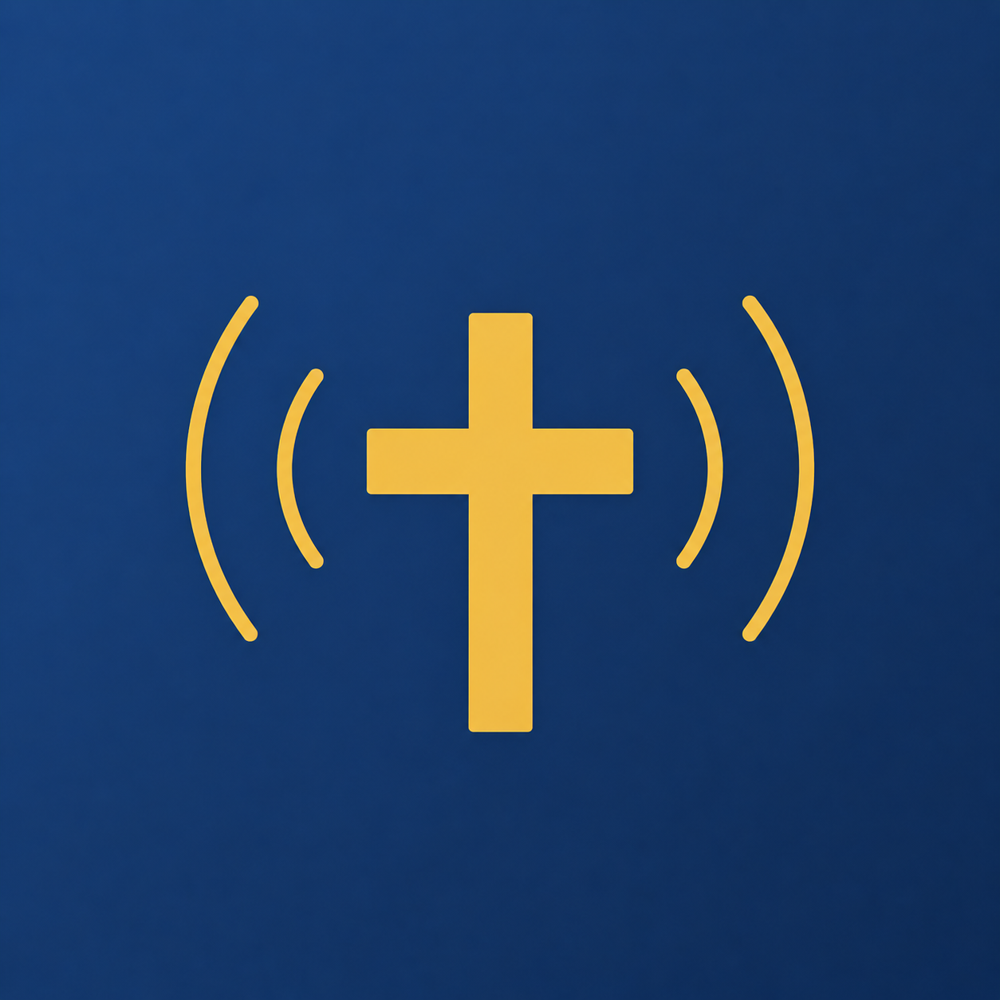

<div align="center">
  

  # SundayRec

  **Automated church-service recorder for macOS and Windows.**
  Records, prepares, and publishes Sunday services as podcasts — set it once, forget it.

  [](https://github.com/richardfossland/sundayrec/releases/latest)
  [](#tests)
  [](LICENSE)
  [](#system-requirements)

  [Download](https://github.com/richardfossland/sundayrec/releases/latest) ·
  [Quick start](docs/QUICK-START.md) ·
  [Website](https://sundayrec.com) ·
  [Report an issue](https://github.com/richardfossland/sundayrec/issues/new/choose)
</div>

---

> **Norsk:** Norsk hurtigstart-guide finnes på [docs/QUICK-START.md](docs/QUICK-START.md).
> Resten av dokumentasjonen på GitHub er på engelsk slik at den er tilgjengelig for et internasjonalt publikum.

## What it does

SundayRec is a desktop app for churches that need to record, edit, and share their services without an audio engineer on site. You connect a USB mixer (or use a built-in microphone), set a weekly schedule — for example "Sunday 11:00–12:00" — and the app handles the rest: it wakes the machine before the service, records the audio, masters it to broadcast-quality loudness, suggests chapter markers, and (optionally) publishes it as a podcast that appears on Spotify, Apple Podcasts and every other major directory.

There is no cloud service. SundayRec runs entirely on your own computer; recordings are stored locally, and any cloud backup goes to *your* Google Drive or Dropbox account — never to SundayRec servers.

## Key features

- **Automatic scheduled recording** — weekly slots plus one-off specials (e.g. Christmas Eve)
- **Live RTMP streaming** *(new in v4.38)* — stream services live to YouTube, Facebook, or your own RTMP server, multi-destination from one ffmpeg process. No subscription, no cloud middleman, no scenes to learn.
- **Local AI transcription** *(new in v4.37)* — transcribe sermons to searchable text on-device with `whisper.cpp`. Four model tiers from Base to Large Turbo Q5. Click any segment in the transcript to jump the playhead. SRT export for YouTube subtitles.
- **YouTube upload** *(new in v4.34)* — publish video recordings directly to YouTube from the editor. Resumable upload protocol with live progress; defaults to private so you can review before going public.
- **Automatic sermon detection** *(new in v4.33)* — analyses the recording on file load, finds the sermon block, and suggests one-click trim of the surrounding music and announcements. Sermon-only recordings (no full service) are detected and kept intact.
- **Norwegian church calendar built in** — Easter, Christmas, Allehelgensdag and other dates highlighted automatically; add your own
- **Professional mastering** — four ffmpeg-based EBU R128 LUFS-normalised presets (speech-natural, speech-clear, speech-punchy, music+speech)
- **Voice-activity detection (VAD)** — automatic chapter markers around sermon and hymn boundaries
- **Cloud backup** — Google Drive and Dropbox (OneDrive support is in the codebase but hidden in the UI until Microsoft app verification is complete)
- **Podcast RSS feed** — a single feed URL you submit once to Spotify for Podcasters and Apple Podcasts Connect; new episodes appear automatically
- **Built-in editor** — waveform view, intro/outro on timeline, playhead extends through intro/outro, snap-to-segment, parametric EQ, format export
- **Wake-from-sleep scheduling** — uses `pmset` on macOS and Task Scheduler on Windows so the machine can stay in low-power mode between services
- **7 languages** — Norwegian, English, German, Swedish, Danish, Polish, French — with 780+ translated strings each, including tooltips
- **Privacy by design** — no telemetry, no cloud middleman. Transcription and streaming both run entirely on your machine; only RTMP handshakes leave the device.
- **Signed and notarised** — Apple Developer ID notarised builds for macOS; signed installer for Windows

## Install

### macOS

1. Download the latest `.dmg` from [the releases page](https://github.com/richardfossland/sundayrec/releases/latest) (Apple Silicon or Intel)
2. Open the `.dmg`
3. Drag **SundayRec** into the **Applications** folder
4. Open the app normally — no Gatekeeper warning, since the build is notarised by Apple

### Windows

1. Download `SundayRec-Setup-x.y.z.exe` from [the releases page](https://github.com/richardfossland/sundayrec/releases/latest)
2. Run the installer
3. Follow the wizard — choose an install directory if you like
4. SundayRec is added to the Start menu and (optionally) the desktop

Updates are delivered automatically in the background through [electron-updater](https://www.electron.build/auto-update); there is nothing to do manually.

## First-time setup

The first launch opens a short onboarding wizard:

1. **Audio source** — pick your USB mixer or built-in microphone
2. **Schedule** — pick a day and time for the weekly service
3. **Storage location** — where recordings should be saved on disk

Detailed walkthrough for non-technical volunteers (in Norwegian): **[docs/QUICK-START.md](docs/QUICK-START.md)**.

## How it works

1. **Schedule** — you define one or more recurring slots (e.g. Sunday 11:00–12:00) and any one-off special services
2. **Wake** — the OS scheduler (`pmset` / Task Scheduler) wakes the machine ~10 minutes before each slot
3. **Record** — a native recorder process captures audio (and optionally video) directly from the selected device
4. **Prep** — when recording ends, the audio is mastered, analysed for voice activity, and chapter markers are generated
5. **Review** — on Monday morning the episode appears in the review queue with a notification by tray, email and/or webhook
6. **Publish** — one click adds it to your RSS feed, where Spotify and Apple Podcasts pick it up automatically

## Reliability — what happens when things go wrong?

Recording a Sunday service is a real-world job, not a software demo. SundayRec is designed around the assumption that *something will fail eventually*. Here is what happens in the common failure modes:

- **Power loss / sudden shutdown.** The recorder writes the audio file continuously while recording. If the machine loses power mid-sermon, the partial file is salvaged at next startup via ffmpeg remux (`recoverPartial` in `src/main/recorder.ts`) — you get *most* of the sermon, not nothing. The partial-file recovery is logged so the operator sees what happened.
- **USB mixer disconnect.** A reconnect watchdog kicks in: SundayRec writes the recording so far to disk, then opens a new file when the mixer comes back. After the service, the new "Merge reconnect segments" step joins them losslessly.
- **Disk fills up.** Pre-flight check on every startup warns if free space is below ~3× the expected recording length. A scheduled session refuses to start if the projected size won't fit, rather than recording 25 min and crashing.
- **Mic not detected before service.** The Hjem page surfaces "device not connected" as a red banner; an email/webhook notification fires if configured. Use the "Test recording (30 sec)" button mid-week to verify everything works *before* Sunday.
- **Wake-from-sleep fails.** Wake reliability varies by OS and hardware. Apple Silicon Macs *cannot* wake from full shutdown (only from sleep). Windows machines often miss wakes after a forced OS reboot for updates. SundayRec ships an honest capability detector (`Tidsplan → Vekk maskin fra dvale`) that tells you what *your specific machine* can and cannot do. The "Test wake" feature schedules a wake 60 seconds out and reports whether the OS actually fired it — run this Friday before a Sunday service.
- **ffmpeg crashes mid-stream during live broadcast.** Streamer auto-restarts up to 3 times with 5 s delay between attempts. The UI shows "Recovering…" instead of going dark. After 3 failed restarts, it gives up and surfaces the error.
- **Whisper transcription on a slow machine.** The recommended model (Large Turbo Q5) needs Apple Silicon or a recent Intel CPU to finish in reasonable time. On older hardware, pick `Base` for ~14× real-time speed at lower accuracy. Transcription is fully optional — recordings work without it.

We strongly recommend using the "Test recording" feature mid-week and "Test wake" the Friday before. Both surface configuration problems *before* the actual service rather than during it.

## System requirements

|              | macOS                          | Windows                  |
| ------------ | ------------------------------ | ------------------------ |
| OS           | macOS 12 Monterey or newer     | Windows 10 / 11          |
| Architecture | Apple Silicon (M1–M4) or Intel | x64                      |
| Audio input  | USB mixer or built-in mic      | USB mixer or built-in mic |
| Storage      | ~100 MB / hour (MP3 192 kbps)  | ~100 MB / hour (MP3 192 kbps) |
| Network      | Only needed for cloud / podcast | Only needed for cloud / podcast |

## Supported audio formats

The editor can import and export MP3, WAV, FLAC, AAC, WMA, OGG, OGA, OPUS, AIFF, AIF, AC3, EAC3, DTS, AMR, CAF, WV, TTA, AU, APE, MPC and around 10 more (30+ formats in total) via the bundled `ffmpeg`.

## Documentation

- [Quick Start Guide](docs/QUICK-START.md) — set up SundayRec in 10 minutes (Norwegian)
- [Cloud + Podcast Setup](docs/SETUP-CLOUD.md) — register your own OAuth apps for Google Drive and Dropbox
- [Privacy & Data Handling](PRIVACY.md) — what data is stored where, and what never leaves your machine
- [Changelog](CHANGELOG.md) — release notes for every version
- [Report an issue](https://github.com/richardfossland/sundayrec/issues/new/choose) — bug report or feature request

## Tests

```bash
npm install
npm test
```

The current suite is 1044 tests across 32 suites, pinned to the `Europe/Oslo` timezone so DST handling is deterministic. CI runs the suite on every push.

## License

SundayRec is **source-available** under a custom license — see [LICENSE](LICENSE).

In short:

- You may **read** the source, **inspect** it, run it on your own machine for personal or non-profit religious use, and contribute patches via GitHub
- You **may not** redistribute it, sell it, repackage it, or use it commercially without a written agreement

For commercial licensing or partnerships, contact **hello@sundayrec.com**.

## Contact

- Email: **hello@sundayrec.com**
- Website: **https://sundayrec.com**
- Issues: **https://github.com/richardfossland/sundayrec/issues**

Built and maintained by [Richard Fossland](https://github.com/richardfossland) in Norway.
